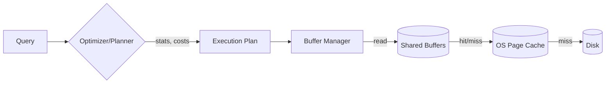
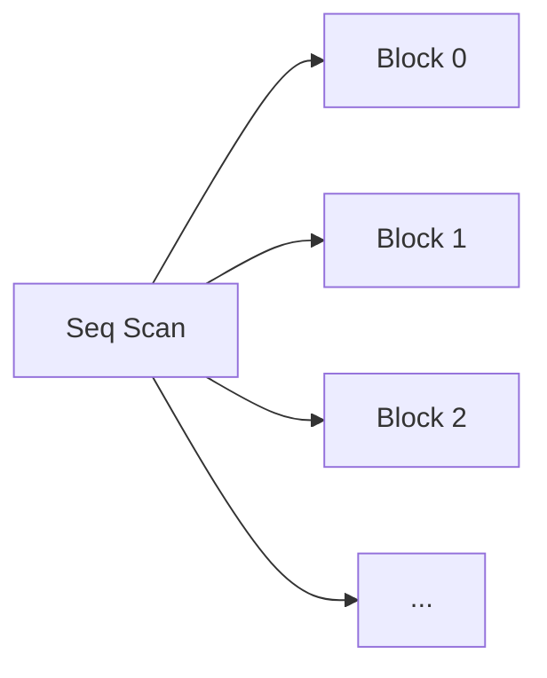
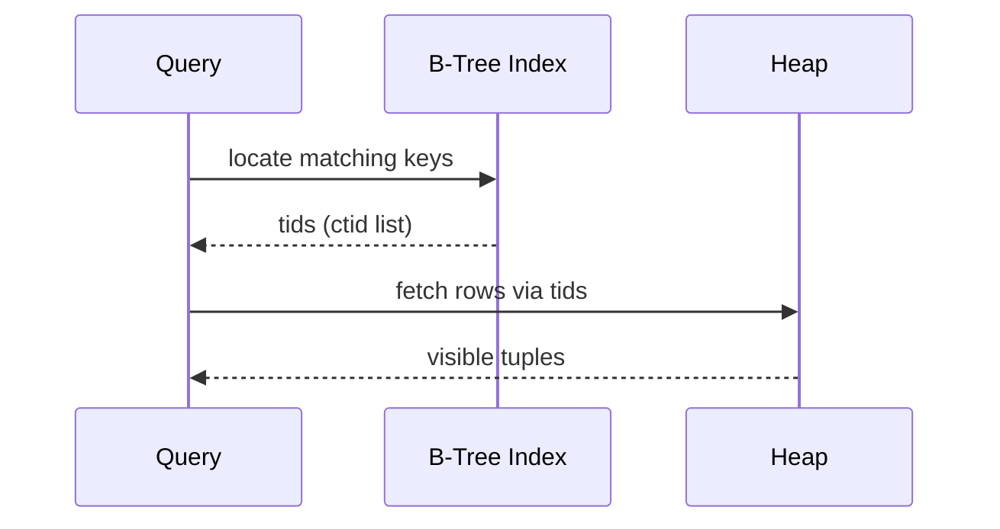
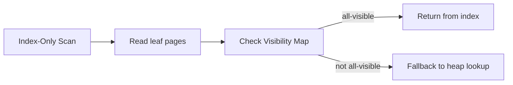
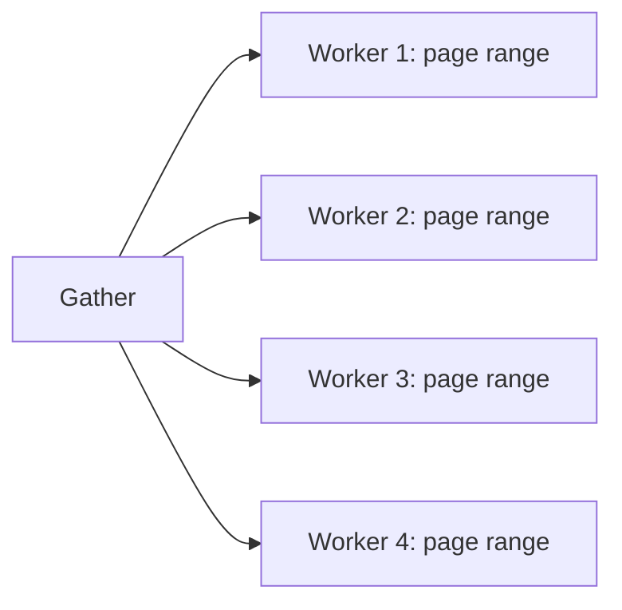
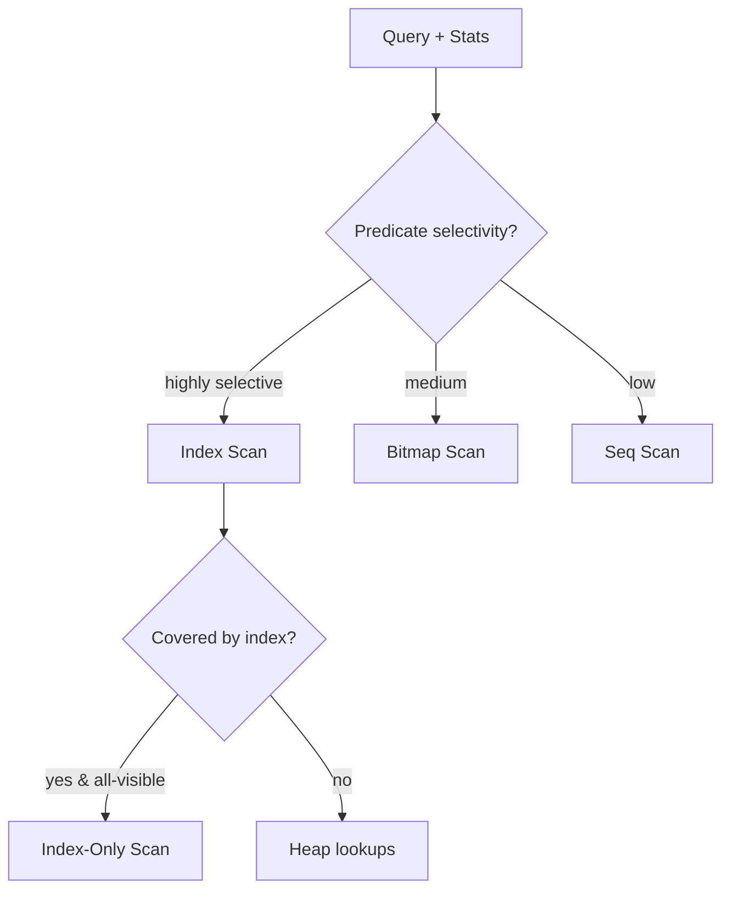

# PostgreSQL Data Scans — პრაქტიკული დოკუმენტაცია

> ეს ჩანახატი მოკლედ და სტრუქტურად ხსნის PostgreSQL‑ში მონაცემების წაკითხვის (scan) ყველაზე მნიშვნელოვან ტიპებს, როგორ არჩევს მათ Planner‑ი, რა პარამეტრები ახდენს გავლენას, როგორ გავტიუნინგოთ და როგორ წავიკითხოთ `EXPLAIN`/`EXPLAIN ANALYZE` შედეგები. თან ერთვის დიაგრამები (Mermaid) კონცეფტების ვიზუალიზაციისთვის.

---

## ვიზუალური მიმოხილვა (Cheat Sheet)


**ლეგენდა:**
- **Sequential Scan** — ცხრილის ბლოკების ზედიზედ კითხვა.
- **Index Scan** — ინდექსით ტიდების პოვნა → heap-ის random მოძებნა თითოეული ჰიტისთვის.
- **Bitmap Index Scan → Bitmap Heap Scan** — ინდექს(ებ)იდან ბიტმაპის აგება, შემდეგ ჯგუფური heap წაკითხვა.
- **Parallel Scan** — რამდენიმე worker კითხულობს მონაკვეთებს; შედეგები იკრიბება **Gather**-ში.
- **Parallel Index Scan** — ინდექსიანი ამოღება პარალელურად (შეზღუდვებით, იშვიათია პრაქტიკაში).
- **Index‑Only Scan** — ყველა საჭირო სვეტი ინდექსშია და ბლოკები all‑visible → heap lookup არ კეთდება.

---

## 1) სწრაფი მიმოხილვა
PostgreSQL ცხრილიდან რიგების ასაღებად იყენებს ძირითად სკანის სტრატეგიებს:

- **Sequential Scan (Seq Scan)** — ცხრილის ყველა ბლოკის ზედიზედ კითხვა.
- **Index Scan** — ინდექსით მოძებნა, შემდეგ შესაბამისი heap რიგების მოტანა.
- **Index‑Only Scan (IOS)** — მხოლოდ ინდექსიდან წაკითხვა, თუ **Visibility Map** იძლევა ამის საშუალებას.
- **Bitmap Index Scan + Bitmap Heap Scan** — მრავალი შესაბამისი tuple-ის ეფექტური ჯგუფური მოზიდვა.
- **TID Scan (ctid)** — უშუალოდ ფიზიკური მისამართებით წვდომა.
- **Parallel** ვარიანტები — პარალელური Seq/Bitmap გეგმები დიდი ცხრილებისთვის.

### Planner-ის არჩევანი, ძალიან მოკლედ
- მცირე ცხრილებზე ან ფართო ფილტრზე → ხშირად **Seq Scan**.
- ძალიან სელექტიურ WHERE/Join პირობებზე → **Index Scan** ან **IOS**.
- „შუალედურ“ სელექტივობაზე ან მრავლობით პირობებზე → **Bitmap** გეგმები.
- თუ მხოლოდ რამდენიმე კონკრეტული `ctid` იცით → **TID Scan**.

---

## 2) Heap, Page და Visibility (ძალიან მოკლე საფუძვლები)
PostgreSQL‑ის ცხრილი ინახავს რიგებს **heap** ფაილში (8KB ბლოკები). თითოეულ რიგს აქვს ფიზიკური მისამართი `ctid = (block, offset)`. ხილვადობა (MVCC) ანგარიშდება transaction snapshot‑ის მიხედვით; **Visibility Map (VM)** აღნიშნავს ბლოკებს, სადაც ყველა რიგი ხილვადია (all‑visible) — ეს საჭიროა **Index‑Only Scan**‑ისთვის, რომ heap‑ში არ გადავიდეს.



---

## 3) Sequential Scan
ყველა ბლოკი იკითხება ზედიზედ. იაფი *per‑tuple* ღირებულება, მაგრამ კითხულობს ბევრ არასაჭიროსაც.

**როდის ჯობს:**
- პატარა ცხრილები ან `WHERE` პრაქტიკულად არაფერს ფილტრავს.
- ცხრილის დიდი ნაწილი მაინც გვჭირდება (მაგ., `SELECT COUNT(*)` ინდექსის გარეშე).

```sql
EXPLAIN ANALYZE
SELECT * FROM orders WHERE created_at >= now() - interval '7 days';
```



**Cost drivers:** `seq_page_cost`, ეფექტური cache‑ი.

---

## 4) Index Scan
Planner‑ი იყენებს ინდექსს შესატყვისი გასაღებების პოვნაში, შემდეგ თითოეული ჰიტისთვის მიდის heap‑ში (random I/O), ამოწმებს MVCC ხილვადობას და აბრუნებს რიგს.

**როდის ჯობს:** ძალიან სელექტიური პირობები, `ORDER BY` ინდექსის თანმიმდევრობასთან თავსებადი, `LIMIT` მცირეა.

```sql
CREATE INDEX ON orders (customer_id, created_at);
EXPLAIN ANALYZE
SELECT *
FROM orders
WHERE customer_id = 42
ORDER BY created_at DESC
LIMIT 10;
```



**Cost drivers:** `random_page_cost`, სელექტივობის სტატისტიკა, კლასტერული კორელაცია (`pg_statistic.correlation`).

---

## 5) Index‑Only Scan (IOS)
თუ მოთხოვნილი სვეტები მთლიანად არის ინდექსში **და** შესაბამისი ბლოკები **VM‑ში all‑visible**ა, Executor‑ს შეუძლია აღარ გადავიდეს heap‑ში.

**სარგებელი:** მკვეთრად ნაკლები I/O + უკეთესი cache locality.

```sql
-- Covering index: ყველა საჭირო სვეტი ინდექსში
CREATE INDEX CONCURRENTLY idx_orders_cov
  ON orders (customer_id, created_at) INCLUDE (status, amount);

EXPLAIN ANALYZE
SELECT customer_id, created_at, status, amount
FROM orders
WHERE customer_id = 42;
```



**პრაქტიკული რჩევები:**
- გამოიყენეთ `INCLUDE` რომ „covering“ გახადოთ ინდექსი.
- შეინარჩუნეთ **vacuum** და **autovacuum**, რომ Visibility Map იყოს განახლებული.

---

## 6) Bitmap Index Scan + Bitmap Heap Scan
ინდექსი აგენერირებს **bitmap‑ს** (რომელი ბლოკებიდან რა offsets გვაინტერესებს). შემდეგ **Bitmap Heap Scan** ვიზიტებს ბლოკებს ჯგუფურად (I/O batching). ეს კარგია, როცა ჰიტები ბევრია, მაგრამ არა „ყველა“.

```sql
EXPLAIN ANALYZE
SELECT *
FROM events
WHERE kind IN ('click','view')
  AND created_at >= date_trunc('day', now()) - interval '30 days';
```

```mermaid
flowchart LR
  A[Bitmap Index Scan (idx_kind)] --> B[(Bitmap)]
  C[Bitmap Index Scan (idx_created_at)] --> B
  B --> D[Bitmap Heap Scan → batched page reads]
```

**Cost drivers:** `work_mem` (ბიტმაპის ზომისთვის), ჰიტების რაოდენობა/გაოცრება, მრავლობითი ინდექსის კომბინაცია.

---

## 7) TID Scan (ctid)
თუ იცით კონკრეტული ფიზიკური მისამართები (`ctid`), შეგიძლიათ უშუალოდ ამოიღოთ რიგები. იშვიათად ხელით, უფრო ხშირად — planner‑ის შიდა გადაწყვეტილებად.

```sql
-- მაგალითი: წინასწარ მიღებული ctids დროებით ცხრილში
SELECT *
FROM big_table b
JOIN tmp_ctids t ON b.ctid = t.ctid;
```

---

## 8) პარალელური გეგმები
- **Parallel Seq Scan** — დიდი ცხრილები, დაბალი სელექტიურობა.
- **Parallel Bitmap Heap Scan** — როცა ბიტმაპი დიდი/შუა ზომისაა.

```sql
SET max_parallel_workers_per_gather = 4;
EXPLAIN ANALYZE
SELECT count(*) FROM fact_logs WHERE ts >= now() - interval '3 days';
```



> შენიშვნა: პარალელური Index Scan მხარდაჭერა შეზღუდულია და დამოკიდებულია ინდექსის ტიპზე/ვერსიაზე; პრაქტიკაში შედარებით იშვიათია. ყველაზე ეფექტური პარალელური გეგმა ხშირად Seq/Bitmap ნაირსახეობებია.

---

## 9) როგორ ირჩევს Planner‑ი



მთავარი მეტრიკები/პარამეტრები:
- **სტატისტიკა:** `ANALYZE`, `default_statistics_target`, ჰისტოგრამები/MCV.
- **გაიდლაინები:** `enable_seqscan`, `enable_indexscan`, `enable_bitmapscan` (დროებით ტუნინგ/დიაგნოსტიკისთვის).
- **ხარჯები:** `random_page_cost`, `seq_page_cost`, `cpu_tuple_cost`, `cpu_index_tuple_cost`.
- **ქეში:** `effective_cache_size` (Planner-ს ეუბნება რამდენია cache-ით ხელმისაწვდომი).
- **კორელაცია:** თუ ცხრილი ინდექსის თანმიმდევრობასთან კორელირებულია, random I/O ფაქტობრივად უფრო თანმიმდევრული ხდება (იხ. `pg_stats.correlation`).

---

## 10) `EXPLAIN` პრაქტიკული მაგალითები

### 10.1) სელექტიური ფილტრი → Index Scan
```sql
EXPLAIN (ANALYZE, BUFFERS)
SELECT * FROM users WHERE email = 'a@b.c';
```
სავარაუდო გეგმა: `Index Scan using users_email_key on users ...` + მცირე heap ჰიტები.

### 10.2) ბევრი ჰიტი → Bitmap
```sql
EXPLAIN (ANALYZE, BUFFERS)
SELECT * FROM orders WHERE status IN ('paid','shipped');
```
სავარაუდო გეგმა: `Bitmap Index Scan` + `Bitmap Heap Scan` და მაღალი shared read/heap hit batching.

### 10.3) Covering → Index‑Only
```sql
EXPLAIN (ANALYZE, BUFFERS)
SELECT order_id, created_at FROM orders WHERE customer_id = 42;
```
სავარაუდო გეგმა: `Index Only Scan using ...` და `Heap Fetches: 0` თუ VM all‑visibleა.

---

## 11) ტიუნინგის რჩევები
- **შექმენით სწორი ინდექსები:** ფილტრები, join keys, sorting keys; გაითვალისწინეთ `INCLUDE`.
- **Multi‑column ინდექსების რიგი:** დაალაგეთ სვეტები სელექტიურობის/ფილტრების/სორტირებების მიხედვით.
- **„სწორი“ random_page_cost:** SSD-ზე 1.1–1.5, HDD-ზე უფრო მაღალი. გამოცადეთ.
- **`effective_cache_size`:** მიახლოეთ სისტემის რეალურ OS cache‑ს.
- **`work_mem`:** გაზრდა ეხმარება Bitmap/Sort/Hash ოპერაციებს, მაგრამ თითო კვანძზეა; სიფრთხილე!
- **ავტომატური მოვლა:** `autovacuum`, `vacuum freeze`, `reindex` (იშვიათად), `CLUSTER` ან `pg_repack` კორელაციის ასამაღლებლად.

---

## 12) პრობლემების დიაგნოსტიკა (ჩეკლისტი)
- `EXPLAIN (ANALYZE, BUFFERS, VERBOSE)` — ნახეთ რეალური დროები, rows, loops.
- აცდენილი შეფასებები? → გაუმჯობესეთ სტატისტიკა (`ANALYZE`, გაზარდეთ `default_statistics_target`).
- Heap Fetches მაღალია IOS‑ზე? → შევამოწმოთ Visibility Map (`VACUUM`/`ANALYZE`).
- ბევრი random read Index Scan‑ზე? → განიხილეთ `CLUSTER` ინდექსზე ან `pg_repack` reorder.
- მრავლობითი პირობები და ბევრი ჰიტი? → Bitmap გეგმის სტიმულირება (`enable_indexscan=off` ტესტისთვის).
- დიდ ცხრილებზე ტროტლინგი? → `max_parallel_workers_per_gather`, `maintenance_work_mem` (VACUUM).

---

## 13) სასარგებლო View/Extension‑ები
- `pg_stat_user_tables`, `pg_stat_all_indexes` — I/O/scan counters.
- `pg_statio_user_tables`, `pg_statio_user_indexes` — ბლოკური სტატისტიკა.
- `pg_buffercache` (extension) — რა ბლოკებია ქეშში.
- `auto_explain` — ნელი მოთხოვნების გეგმების ლოგვინგი.

---

## 14) სწრაფი რეცეპტები
- **ხშირად გამოძახებადი მცირე lookup:** `PRIMARY KEY`/`UNIQUE` ინდექსი + IOS.
- **Range queries დროზე:** `(ts)` btree ან BRIN ძალიან დიდ, მონოტონურ ცხრილებზე.
- **მრავალი დროშა/კატეგორია:** ცალკე ინდექსები + Bitmap კომბინაცია.
- **Reporting COUNT(*) უზარმაზარ ცხრილზე:** `approx_count_distinct`/ჰიპერლოგლოგი? ან materialized summary ცხრილები.

---

## 15) მოკლე „FAQ“
- **რატომ აკეთებს Seq Scan‑ს ინდექსის ნაცვლად?** — ან სელექტიური არაა, ან სტატისტიკა ცდება, ან ქეში/ხარჯების პარამეტრები Planner‑ს აძლევს Seq‑ს.
- **რატომ არაა Index‑Only?** — ინდექსი არ „ფარავს“ ყველა სვეტს ან VM არაა all‑visible.
- **კიდევ რა ინდექსებია?** — B‑Tree (ნაგულისხმები), Hash, GIN, GiST, SP‑GiST, BRIN — არჩევანი დამოკიდებულია ოპერატორებზე/მონაცემის ბუნებაზე.

---

_დოკუმენტი განკუთვნილია პრაქტიკურ გზამკვლევად. სურვილის შემთხვევაში დავამატებ კონრეტული `EXPLAIN ANALYZE` ლოგების დეტალურ განხილვას და ინდექსაციის რეკომენდაციებს თქვენი სქემისთვის._
