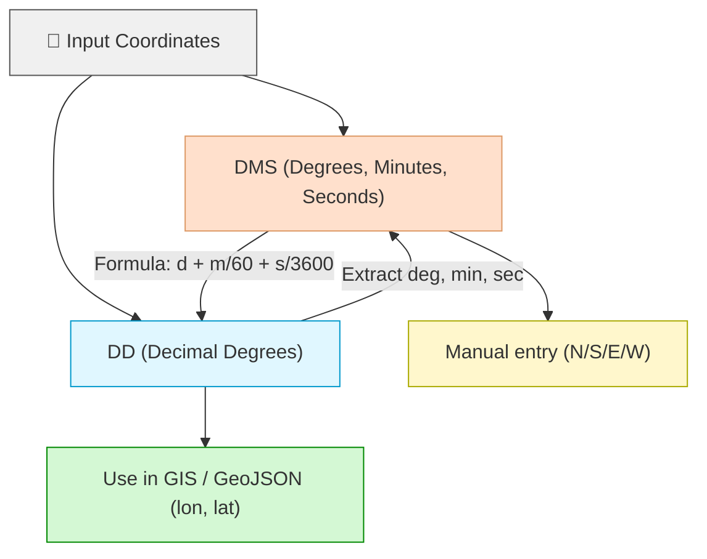

## კოორდინატების კონვერტაცია - Coordinate conversion


### გრადუსები მინუტები სეკუნდებიდან > მეათედ გრადუსებში
Degrees, Minutes, Seconds > Decimal Degrees 

Kotia Cave, Chiatura-Perevisa-Sveri-Tvalueti-Gezruli, Georgia. <br>
კოორდინატები [Google Earth - იდან](https://www.google.com/maps/place/42%C2%B012'47.8%22N+43%C2%B019'27.7%22E/@42.2058273,43.2713168,21099m/data=!3m1!1e3!4m4!3m3!8m2!3d42.213286!4d43.324367?entry=ttu&g_ep=EgoyMDI0MTIxMS4wIKXMDSoASAFQAw%3D%3D) <br>
42°12'47.83"N 43°19'27.72"E > 42.213286° 43.324367° 

```py title="DMS_DD.py" linenums="1" hl_lines="7 8"

def transformation(deg, min, sec):

    result = deg + min/60 + sec/3600

    return result

print(transformation(42, 12, 47.83))
print(transformation(43, 19, 27.72))

#შედეგი: 42.21328611111112 43.32436666666667
```

### მეათედი გრადუსებიდან > გრადუსები მინუტები სეკუნდებზე
Decimal Degrees > Degrees, Minutes, Seconds

```py title="DD_DMS.py" linenums="1" hl_lines""
def reverse_transform(decimal_deg):

    degrees = int(decimal_deg)

    decimal_min = (decimal_deg - degrees) * 60

    minutes = int(decimal_min)

    seconds = (decimal_min - minutes) * 60
    
    return degrees, minutes, seconds

print(reverse_transform(41.688554))
print(reverse_transform(44.693789))

#შედეგი 
(41, 41, 18.794400000012388)
(44, 41, 37.64040000000875)
```

გრადუსები მინუტები სეკუნდები, მეათედ მინუტებზე

გასარჩევია

def dms_to_dd(d, m, s):

    """Converts degrees, minutes, and seconds to decimal degrees."""

    dd = d + m/60 + s/3600

    return dd


def convert_coordinates(coordinates):

    """Converts a list of coordinates from DMS to DD format."""

    decimal_coordinates = []

    for coord in coordinates:

        d, m, s = coord

        dd = dms_to_dd(d, m, s)

        decimal_coordinates.append(dd)

    return decimal_coordinates


# List of coordinates in DMS format: (degrees, minutes, seconds)

coordinates_dms = [

    (45, 30, 15),

    (60, 20, 10),

    (30, 15, 45)

]


# Convert coordinates to DD format

decimal_coordinates = convert_coordinates(coordinates_dms)

print(decimal_coordinates)


print(transformation(45, 31, 14.306))

print(transformation(45, 31, 14.697))

print(transformation(45, 31, 14.660))

print(transformation(45, 31, 14.699))

print(transformation(45, 31, 14.510))

print(transformation(45, 31, 14.333))

print(transformation(45, 31, 14.296))

print(transformation(45, 31, 14.041))

print(transformation(45, 31, 14.079))

print(transformation(45, 31, 14.040))

print(transformation(45, 31, 14.229))

print(transformation(45, 31, 14.268))


print('N')


print(transformation(41, 57, 18.654))

print(transformation(41, 57, 18.513))

print(transformation(41, 57, 18.454))

print(transformation(41, 57, 18.440))

print(transformation(41, 57, 18.148))

print(transformation(41, 57, 18.211))

print(transformation(41, 57, 18.153))

print(transformation(41, 57, 18.244))

print(transformation(41, 57, 18.303))

print(transformation(41, 57, 18.317))

print(transformation(41, 57, 18.609))

print(transformation(41, 57, 18.595))


def dms_to_dd(d, m, s):

    """Converts degrees, minutes, and seconds to decimal degrees."""

    dd = d + m/60 + s/3600

    return dd


def convert_coordinates(coordinates):

    """Converts a list of coordinates from DMS to DD format."""

    decimal_coordinates = []

    for coord in coordinates:

        d, m, s = coord

        dd = dms_to_dd(d, m, s)

        decimal_coordinates.append(dd)

    return decimal_coordinates


# List of coordinates in DMS format: (degrees, minutes, seconds)

coordinates_dms_north = [

    (45, 31, 14.306),

    (45, 31, 14.697),

    (45, 31, 14.660),

    (45, 31, 14.699),

    (45, 31, 14.510),

    (45, 31, 14.333),

    (45, 31, 14.296),

    (45, 31, 14.041),

    (45, 31, 14.079),

    (45, 31, 14.040),

    (45, 31, 14.229),

    (45, 31, 14.268)

]


coordinates_dms_south = [

    (41, 57, 18.654),

    (41, 57, 18.513),

    (41, 57, 18.454),

    (41, 57, 18.440),

    (41, 57, 18.148),

    (41, 57, 18.211),

    (41, 57, 18.153),

    (41, 57, 18.244),

    (41, 57, 18.303),

    (41, 57, 18.317),

    (41, 57, 18.609),

    (41, 57, 18.595)

]


# Convert coordinates to DD format

decimal_coordinates_north = convert_coordinates(coordinates_dms_north)

decimal_coordinates_south = convert_coordinates(coordinates_dms_south)


# Save coordinates to a text file

with open("converted_coordinates.txt", "w") as file:

    file.write("North Coordinates:\n")

    for coord in decimal_coordinates_north:

        file.write(f"{coord}\n")

    

    file.write("\nSouth Coordinates:\n")

    for coord in decimal_coordinates_south:

        file.write(f"{coord}\n")


print("Coordinates have been saved to 'converted_coordinates.txt' file.")


# 📍 კოორდინატების კონვერტაცია — Coordinate Conversion

კოორდინატები ხშირად გვხვდება ორ ფორმატში:  
- **DMS** — Degrees, Minutes, Seconds (გრადუსები, წუთები, წამები)  
- **DD** — Decimal Degrees (მეათედი გრადუსები)

ქვემოთ ნახავ კონვერტაციის ფორმულებს, Python მაგალითებს და QGIS-ში სამუშაო ლაბორატორიულ ინსტრუქციას.

---

## 1) DMS → DD (გრადუსები/წუთები/წამებიდან მეათედ გრადუსებზე)

**ფორმულა:**  
\[
\text{DD} = d + \frac{m}{60} + \frac{s}{3600}
\]  
> შენიშვნა: სამხრეთ/დასავლეთ ნახევარსფეროებისთვის DD უნდა იყოს უარყოფითი (N/E = +, S/W = −).

**მაგალითი (Kotia Cave, Chiatura-Perevisa-Sveri-Tvalueti-Gezruli, Georgia):**  
კოორდინატები [Google Earth-იდან](https://www.google.com/maps/place/42%C2%B012'47.8%22N+43%C2%B019'27.7%22E/@42.2058273,43.2713168,21099m/data=!3m1!1e3!4m4!3m3!8m2!3d42.213286!4d43.324367?entry=ttu&g_ep=EgoyMDI0MTIxMS4wIKXMDSoASAFQAw%3D%3D)  
`42°12'47.83"N 43°19'27.72"E` → `42.213286° , 43.324367°`

```py title="DMS_DD.py" linenums="1"
def dms_to_dd(deg, minutes, seconds, ref=None):
    """Converts DMS to decimal degrees. ref: 'N','S','E','W' (optional)"""
    dd = deg + minutes/60 + seconds/3600
    if ref in ('S', 'W'):
        dd = -dd
    return dd

# მაგალითი
print(dms_to_dd(42, 12, 47.83, 'N'))  # 42.213286...
print(dms_to_dd(43, 19, 27.72, 'E'))  # 43.324367...
```

---

## 2) DD → DMS (მეათედი გრადუსებიდან გრადუსები/წუთები/წამებზე)

```py title="DD_DMS.py" linenums="1"
def dd_to_dms(decimal_deg):
    """Converts decimal degrees to (degrees, minutes, seconds)."""
    sign = -1 if decimal_deg < 0 else 1
    decimal_deg = abs(decimal_deg)

    degrees = int(decimal_deg)
    decimal_min = (decimal_deg - degrees) * 60
    minutes = int(decimal_min)
    seconds = (decimal_min - minutes) * 60

    return sign * degrees, minutes, seconds

print(dd_to_dms(41.688554))
print(dd_to_dms(44.693789))
# შედეგი:
# (41, 41, 18.7944...)
# (44, 41, 37.6404...)
```

---

## 3) სიის კონვერტაცია (Batch) — DMS → DD

```py title="convert_list_dms_to_dd.py" linenums="1"
def dms_to_dd(d, m, s):
    return d + m/60 + s/3600

def convert_coordinates(dms_list):
    return [dms_to_dd(d, m, s) for (d, m, s) in dms_list]

# მაგალითი
coordinates_dms = [
    (45, 30, 15),
    (60, 20, 10),
    (30, 15, 45),
]
print(convert_coordinates(coordinates_dms))
```

---

## 4) ორი სუბსეტის კონვერტაცია + ფაილში შენახვა

```py title="batch_convert_and_save.py" linenums="1"
def dms_to_dd(d, m, s):
    return d + m/60 + s/3600

def convert_coordinates(dms_list):
    return [dms_to_dd(d, m, s) for (d, m, s) in dms_list]

coordinates_dms_north = [
    (45, 31, 14.306),
    (45, 31, 14.697),
    (45, 31, 14.660),
    (45, 31, 14.699),
    (45, 31, 14.510),
    (45, 31, 14.333),
]

coordinates_dms_south = [
    (41, 57, 18.654),
    (41, 57, 18.513),
    (41, 57, 18.454),
    (41, 57, 18.440),
    (41, 57, 18.148),
    (41, 57, 18.211),
]

north_dd = convert_coordinates(coordinates_dms_north)
south_dd = convert_coordinates(coordinates_dms_south)

with open("converted_coordinates.txt", "w", encoding="utf-8") as f:
    f.write("North Coordinates (DD):\n")
    for val in north_dd:
        f.write(f"{val}\n")
    f.write("\nSouth Coordinates (DD):\n")
    for val in south_dd:
        f.write(f"{val}\n")
print("Coordinates have been saved to 'converted_coordinates.txt'.")
```

---

## 5) სწრაფი სერვისული ფუნქციები

```py title="utils_coords.py" linenums="1"
def dms_to_dd(d, m, s, ref=None):
    dd = d + m/60 + s/3600
    if ref in ('S', 'W'):
        dd = -dd
    return dd

def dd_to_dms(dd):
    sign = -1 if dd < 0 else 1
    dd = abs(dd)
    deg = int(dd)
    rem = (dd - deg) * 60
    minu = int(rem)
    sec = (rem - minu) * 60
    return sign * deg, minu, sec
```

---

# 🧑‍🏫 QGIS ლაბორატორიული ინსტრუქცია

## ნაბიჯები

1. **QGIS გახსნა** → `Vector → Geometry Tools → Add Geometry Attributes` (ან *Processing Toolbox*).  
2. **Field Calculator**–ში DD სვეტიდან შეგიძლია გამოყვანო lon/lat.  
   ```sql
   x($geometry)   -- longitude
   y($geometry)   -- latitude
   ```  
3. თუ გაქვს `.csv` DD ფორმატით: `Layer → Add Layer → Add Delimited Text Layer`.  

---

## Python (QGIS Console)

```py
from math import floor

def dd_to_dms(dd):
    sign = -1 if dd < 0 else 1
    dd = abs(dd)
    deg = floor(dd)
    minutes_full = (dd - deg) * 60
    minu = floor(minutes_full)
    sec = (minutes_full - minu) * 60
    return sign*deg, minu, sec

print(dd_to_dms(42.213286))
```

---

## 🗺️ Mermaid დიაგრამა



---

# ✅ Exercise (სტუდენტებისთვის)

**დავალება:**  
1. მოძებნეთ თქვენი სკოლის ადგილის კოორდინატები Google Maps-დან (DMS ფორმატში).  
2. გადაიყვანეთ **DD ფორმატში** Python სკრიპტის გამოყენებით.  
3. შეიტანეთ CSV-ში `lat, lon` სვეტებით.  
4. ჩატვირთეთ QGIS-ში `Add Delimited Text Layer` საშუალებით და შეამოწმეთ რუკაზე.
