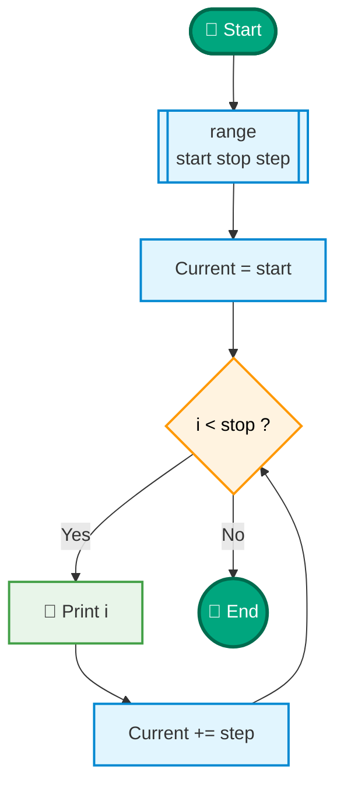
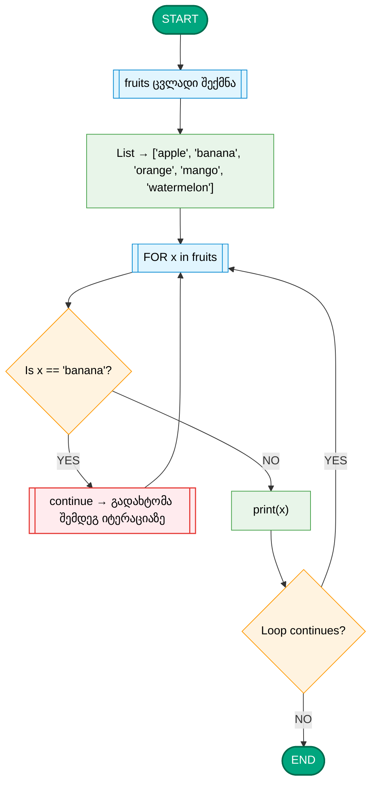
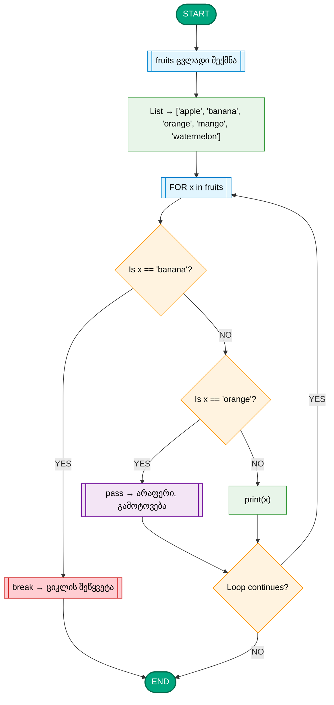

# 🌀 Python — ციკლის ოპერატორები [1]

## ციკლებთან დაკავშირებული მანიპულაციები

Python-ში **ციკლი** არის პროგრამის ფრაგმენტი, რომელიც განმეორებით ასრულებს ერთსა და იმავე კოდს, სანამ გარკვეული პირობა შესრულებულია.  
ციკლების გამოყენება საშუალებას გვაძლევს მოვახდინოთ მონაცემთა გადამუშავება, გამეორება და ავტომატიზაცია.

---

## 🔹 ციკლის ტიპები Python-ში

Python-ში ორი ძირითადი ციკლია:

1. **for loop** — როცა ვიცით გამეორებების ზუსტი რაოდენობა.  
2. **while loop** — როცა გამეორებების რაოდენობა დამოკიდებულია პირობის შესრულებაზე.

---
 
## 🧭 `range()` ფუნქცია Python-ში

`range()` — ეს არის **ჩაშენებული Python ფუნქცია**, რომელიც ქმნის **რიცხვების მიმდევრობას** (sequence).  
იგი გამოიყენება, როცა გვჭირდება ციკლის შესრულება **განსაზღვრული რაოდენობაზე**.

```python
for x in range(2, 10, 2):
    print(x)
```

📘 შედეგი:
```
2  
4  
6  
8
```

➡️ პირველი არგუმენტი – საწყისი,  
➡️ მეორე – ბოლო მნიშვნელობა (არ შედის),  
➡️ მესამე – ნაბიჯი.

მაგალითად:
```python
for i in range(5):
    print(i)
```

➡️ შედეგი:
```
0
1
2
3
4
```

> 💡 `range(5)` ნიშნავს: დაიწყე 0-დან და გაჩერდი სანამ 5-მდე მიხვალ (5 არ შედის შედეგში).

---

## ⚙️ სინტაქსი

```python
range(start, stop, step)
```

### არგუმენტები:

| არგუმენტი | დანიშნულება | მაგალითი | შედეგი |
|------------|--------------|-----------|---------|
| `start` | საიდან დავიწყოთ | `range(2, 6)` | 2, 3, 4, 5 |
| `stop` | სად დასრულდეს (არ შედის შედეგში) | `range(0, 3)` | 0, 1, 2 |
| `step` | რა ნაბიჯით იზრდებოდეს | `range(1, 10, 2)` | 1, 3, 5, 7, 9 |

---

## 🔹 1 არგუმენტი
```python
for i in range(4):
    print(i)
```
➡️ შედეგი:
```
0 1 2 3
```

---

## 🔹 2 არგუმენტი
```python
for i in range(2, 6):
    print(i)
```
➡️ შედეგი:
```
2 3 4 5
```

---

## 🔹 3 არგუმენტი
```python
for i in range(1, 10, 2):
    print(i)
```
➡️ შედეგი:
```
1 3 5 7 9
```

> `step = 2` ნიშნავს, რომ ყოველ იტერაციაზე მნიშვნელობა 2-ით იზრდება.

---

## 🔻 უარყოფითი ნაბიჯი
თუ გინდა უკუღმა დათვლა, გამოიყენე უარყოფითი ნაბიჯი (`-1`):

```python
for i in range(10, 0, -1):
    print(i)
```
➡️ შედეგი:
```
10 9 8 7 6 5 4 3 2 1
```

---

## 🔹 `range()` ობიექტი

`range()` **არ ქმნის სიას**, არამედ ქმნის **range ობიექტს**, რომელიც მეხსიერებაში მხოლოდ საზღვრებს ინახავს.

```python
nums = range(5)
print(nums)
```
➡️ შედეგი:
```
range(0, 5)
```

თუ გინდა ეს ობიექტი გადაიქცეს სიად:
```python
list(range(5))
```
➡️ შედეგი:
```
[0, 1, 2, 3, 4]
```

---

## 🧩 გამოყენება `for` ციკლთან ერთად

```python
for i in range(1, 6):
    print("Iteration:", i)
```

➡️ შედეგი:
```
Iteration: 1  
Iteration: 2  
Iteration: 3  
Iteration: 4  
Iteration: 5  
```

---

## 🎯 ვიზუალური ახსნა – როგორ მუშაობს `range(start, stop, step)`

---



---

## 💡 მაგალითები პრაქტიკიდან

| ამოცანა | კოდი | შედეგი |
|----------|------|--------|
| 0-დან 9-მდე ყველა რიცხვი | `range(10)` | 0–9 |
| 5-დან 15-მდე | `range(5, 16)` | 5–15 |
| 2-დან 20-მდე მხოლოდ ლუწები | `range(2, 21, 2)` | 2, 4, 6, 8, ... 20 |
| 10-დან 1-მდე უკუღმა | `range(10, 0, -1)` | 10, 9, ... 1 |

---

## 📘 შეჯამება

|  |  |
|----------|---------|
| `range()` ქმნის რიცხვების მიმდევრობას |
| `stop` მნიშვნელობა **არ შედის** შედეგში |
| `step` განსაზღვრავს ნაბიჯს |
| ძალიან ეფექტურია მეხსიერების მხრივ |
| ხშირად გამოიყენება **`for` ციკლებთან** |

---

✳️ **დასკვნა:**  
`range()` არის Python-ის ერთ-ერთი ყველაზე სასარგებლო ინსტრუმენტი,  
რადგან იგი საშუალებას გვაძლევს ციკლში მარტივად განვსაზღვროთ **რამდენჯერ** უნდა შესრულდეს მოქმედება და **რა ინტერვალით**.


### 🔸 for ციკლი

```python
for i in range(5):
    print("Iteration:", i)
```

📘 შედეგი:
```
Iteration: 0  
Iteration: 1  
Iteration: 2  
Iteration: 3  
Iteration: 4
```

🧩 `range(5)` ქმნის რიცხვების მიმდევრობას 0-დან 4-მდე.

---

## 🔹 ციკლის კონტროლის ოპერატორები

| ოპერატორი | აღწერა |
|------------|--------|
| `break`    | წყვეტს ციკლს მთლიანად |
| `continue` | ტოვებს მიმდინარე იტერაციას და გადადის შემდეგზე |
| `pass`     | არაფერს აკეთებს (დამტვირთველი სინტაქსისთვის გამოიყენება) |

---

### 🔸 break მაგალითი

```python
for i in range(10):
    if i == 5:
        break
    print(i)
```

📘 შედეგი:
```
0  
1  
2  
3  
4
```

🧩 ციკლი წყდება როცა `i == 5`.

---

### 🔸 continue მაგალითი

```python
for i in range(6):
    if i == 3:
        continue
    print(i)
```

📘 შედეგი:
```
0  
1  
2  
4  
5
```

➡️ როცა `i == 3`, ბლოკი გამოტოვებულია.

---




---

### 🔸 pass მაგალითი

```python
for i in range(3):
    pass  # დროებით ცარიელი ბლოკი
print("Loop done!")
```

📘 შედეგი:
```
Loop done!
```

🧩 გამოიყენება როცა ბლოკი აუცილებელია სინტაქსურად, მაგრამ ჯერ არაფერს ვწერთ.

---
<br>

---

<br>


```python
# fruits ცვლადი შექმნა
fruits = ['apple', 'banana', 'orange', 'mango', 'watermelon']

# FOR ციკლი
for x in fruits:
    # Is x == 'banana'?
    if x == 'banana':
        print("BREAK: ციკლის შეწყვეტა")
        break  # ← ციკლის სრული შეწყვეტა
    # Is x == 'orange'?
    elif x == 'orange':
        print("PASS: არაფერი, გამოტოვება")
        pass  # ← არაფერი არ ხდება
    else:
        print(x)  # ← print მხოლოდ სხვა ხილვისთვის

print("END: ციკლი დასრულდა")

```


<br>
### 🔸 while ციკლი

```python
count = 0
while count < 5:
    print("Count =", count)
    count += 1
```

📘 შედეგი:
```
Count = 0  
Count = 1  
Count = 2  
Count = 3  
Count = 4
```

➡️ `while` ციკლი იმეორებს ბლოკს მანამ, სანამ პირობა **True**-ა.

---

## 🔹 enumerate()

`enumerate()` აბრუნებს ინდექსს და ელემენტს ერთდროულად.

```python
fruits = ["apple", "banana", "cherry"]
for index, fruit in enumerate(fruits):
    print(index, fruit)
```

📘 შედეგი:
```
0 apple  
1 banana  
2 cherry
```

---

## 🔹 ციკლი სიაზე (list iteration)

```python
numbers = [10, 20, 30, 40]
for n in numbers:
    print(n * 2)
```

📘 შედეგი:
```
20  
40  
60  
80
```

---

## 🔹 ციკლი სტრიქონზე (string iteration)

```python
for letter in "Python":
    print(letter)
```

📘 შედეგი:
```
P  
y  
t  
h  
o  
n
```

---

## 🔹 ციკლი ლექსიკონზე (dictionary iteration)

```python
student = {"name": "Nino", "age": 21, "grade": "A"}

for key, value in student.items():
    print(key, ":", value)
```

📘 შედეგი:
```
name : Nino  
age : 21  
grade : A
```

---

## 🔹 ჩაშენებული ციკლი (Nested Loop)

ციკლი ციკლში გამოიყენება ორმაგი გამეორებებისთვის.

```python
for i in range(3):
    for j in range(2):
        print(f"i={i}, j={j}")
```

📘 შედეგი:
```
i=0, j=0  
i=0, j=1  
i=1, j=0  
i=1, j=1  
i=2, j=0  
i=2, j=1
```

---

## 🔹 მაგალითი — ციკლების კომბინაცია

```python
numbers = [1, 2, 3, 4, 5]
even_sum = 0

for n in numbers:
    if n % 2 == 0:
        even_sum += n

print("ლუწი რიცხვების ჯამი:", even_sum)
```

📘 შედეგი:
```
ლუწი რიცხვების ჯამი: 6
```

---

## 🔹 while + break პრაქტიკული მაგალითი

```python
while True:
    word = input("შეიყვანე სიტყვა (exit გამოსასვლელად): ")
    if word == "exit":
        break
    print("შეიყვანე:", word)
```

📘 ციკლი გაგრძელდება მანამ, სანამ მომხმარებელი არ შეიყვანს "exit".

---

## 🔹 შეჯამება

| ციკლის ტიპი | გამოყენება |
|--------------|------------|
| `for` | წინასწარ ცნობილი გამეორებებისას |
| `while` | პირობის მიხედვით გამეორებებისას |
| `break` | წყვეტს ციკლს |
| `continue` | ტოვებს მიმდინარე გამეორებას |
| `pass` | არაფერს აკეთებს (placeholder) |
| `range()` | რიცხვების მიმდევრობა |
| `enumerate()` | ინდექსი + ელემენტი |

---

📘 **შემდგომი თემა:**  


## დავალება 1: რიცხვების დაჯამება პირობით (while ციკლით)

მიზანი: პროგრამა რიცხვების შეკრებას აგრძელებს მანამ, სანამ ცვლადი current_number არ გახდება 10-ზე მეტი ან ნულზე ნაკლები. გამოიყენეთ while ციკლი.


```python

total_sum = 0
current_number = 5 # საწყისი რიცხვი
limit = 10

print("ციკლი გრძელდება სანამ რიცხვი 0-დან 10-ის ჩათვლით დიაპაზონშია.")

while current_number >= 0 and current_number <= limit:
    print("--------------------")
    print("მიმდინარე რიცხვი: ")
    print(current_number)

    # რიცხვების საერთო ჯამი
    total_sum = total_sum + current_number

    # პირობის შემოწმება და ცვლადის შეცვლა
    if current_number < 3:
        current_number = current_number + 3
        print(" > 3-ზე ნაკლები იყო, 3 დავამატეთ.")
    else:
        current_number = current_number + 5
        print(" > 3-ზე მეტი იყო, 5 დავამატეთ.")

# შედეგის დაბეჭდვა
print("--------------------")
print("ციკლი დასრულდა, რადგან რიცხვი გასცდა 0-10 დიაპაზონს.")
print("საბოლოო რიცხვი: ")
print(current_number)
print("ყველა რიცხვის ჯამი: ")
print(total_sum)

```


## დავალება 2: კენტი რიცხვების დათვლა და ოპერატორები დიაპაზონში (for ციკლით)

მიზანი: დიაპაზონში 1-დან 10-მდე: <br>
თუ რიცხვი 3-ის ტოლია, გამოიყენეთ continue. <br>
როგორც კი რიცხვი მიაღწევს 8-ს, გამოიყენეთ break. <br>
დაითვალეთ კენტი რიცხვების რაოდენობა. <br>


```python

odd_count = 0 # კენტი რიცხვების მრიცხველი
start = 1
end = 10
break_value = 8
continue_value = 3

print("რიცხვების დამუშავება 1-დან 10-მდე...")

for number in range(start, end + 1):
    print("--------------------")
    print("მიმდინარე რიცხვი: ")
    print(number)

    # 2. შეამოწმეთ break
    if number == break_value:
        print("მიღწეულია 8, ციკლი შეწყდა (break).")
        break

    # 1. შეამოწმეთ continue
    if number == continue_value:
        print("რიცხვი 3-ის ტოლია, გამოტოვება (continue)...")
        continue # ციკლი გადადის შემდეგ იტერაციაზე

    # 3. კენტი რიცხვების დათვლა (პირობა % ოპერატორით)
    if number % 2 != 0:
        odd_count = odd_count + 1
        print(" > კენტი რიცხვია, მრიცხველი გაიზარდა.")
    else:
        print(" > ლუწი რიცხვია.")

# შედეგის დაბეჭდვა
print("--------------------")
print("პროგრამა დასრულდა.")
print("კენტი რიცხვების საბოლოო რაოდენობა: ")
print(odd_count)

```


## დავალება 3: სტრინგის სიმბოლოების შემოწმება და დათვლა

მიზანი: სტრინგში "Guria2025" for ციკლის გამოყენებით დაითვალეთ: სიმბოლო 'a'-ს რაოდენობა. <br>
რიცხვითი სიმბოლოების რაოდენობა (გამოიყენეთ ლოგიკური or text = "Guria2025" )


```python

a_count = 0
digit_count = 0

print("სტრინგი: ")
print(text)
print("სიმბოლოების ანალიზი...")

# for ციკლი სტრინგის სიმბოლოებზე
for char in text:
    print("--------------------")
    print("მიმდინარე სიმბოლო: ")
    print(char)

    # 1. 'a' სიმბოლოს შემოწმება
    if char == 'a':
        a_count = a_count + 1
        print(" > აღმოჩენილია 'a'.")

    # 2. რიცხვის სიმბოლოს შემოწმება (ლოგიკური OR ოპერატორით)
    # მხოლოდ რამდენიმე რიცხვს შევამოწმებთ, რომ არ იყოს ძალიან გრძელი
    if char == '0' or char == '1' or char == '2' or char == '5':
        digit_count = digit_count + 1
        print(" > აღმოჩენილია რიცხვითი სიმბოლო (0, 1, 2, ან 5).")


print("--------------------")
print("ანალიზი დასრულდა.")
print("სულ 'a' სიმბოლოების რაოდენობა: ")
print(a_count)
print("სულ რიცხვითი სიმბოლოების რაოდენობა: ")
print(digit_count)

```


## დავალება 4: ლუწი რიცხვების დაბეჭდვა უკუღმა (for ციკლით)

მიზანი: დაბეჭდეთ მხოლოდ ლუწი რიცხვები 20-დან 1-მდე, დათვლის ოპერატორის გამოყენებით range() ფუნქციაში.


```python
start = 20
stop = 0
step = -2

print("ლუწი რიცხვები 20-დან 1-მდე (უკუღმა):")

# range(start, stop, step) - step-ის გამოყენება
for number in range(start, stop, step):
    print(number)

print("ციკლი დასრულდა.")

```


## დავალება 5: ფარული რიცხვის პოვნა (while ციკლით და break-ით)

მიზანი: იპოვეთ და დაბეჭდეთ პირველი რიცხვი 1-დან 10-მდე, რომელიც 4-ის ტოლია. როგორც კი იპოვით, შეწყვიტეთ ციკლი.

```python
secret_number = 4
current = 1

print("ვპოულობთ ფარულ რიცხვს...")

while current <= 10:
    print("--------------------")
    print("მიმდინარე რიცხვი: ")
    print(current)

    # პირობა და break
    if current == secret_number:
        print("ფარული რიცხვი ნაპოვნია!")
        break # ციკლის შეწყვეტა

    current = current + 1 # მრიცხველის ზრდა

# შედეგის დაბეჭდვა
print("პროგრამა დასრულდა.")
print("ნაპოვნი რიცხვი: ")
print(current)

```


## დავალება 6: ხუთეულების გამოტოვება (for ციკლით და continue-ით)

მიზანი: დაბეჭდეთ რიცხვები 1-დან 25-მდე. <br>
თუ რიცხვი 5-ის ჯერადია (იყოფა 5-ზე უნაშთოდ), გამოტოვეთ მისი დაბეჭდვა continue ოპერატორის გამოყენებით.

```python

start = 1
end = 25

print("რიცხვები 1-დან 25-მდე (ხუთეულების გამოკლებით):")

for i in range(start, end + 1):
    # პირობა continue-სთვის (გაყოფადობა)
    if i % 5 == 0:
        print(" >> რიცხვი ")
        print(i)
        print(" 5-ის ჯერადია, გამოტოვება (continue).")
        continue

    # თუ continue არ შესრულდა, რიცხვი დაიბეჭდება
    print("დაბეჭდილი რიცხვი: ")
    print(i)

print("ციკლი დასრულდა.")

```


## დავალება 7: რიცხვის გამრავლება ლიმიტამდე (while ციკლით)

მიზანი: დაიწყეთ რიცხვით 2. <br>
გააგრძელეთ მისი გამრავლება 3-ზე მანამ, სანამ შედეგი არ იქნება 50-ზე მეტი.  <br>
დათვალეთ, რამდენჯერ მოხდა გამრავლება. <br>


```python

number = 2
limit = 50
multiplication_count = 0

print("რიცხვის გამრავლება 50-ის ლიმიტამდე:")

while number <= limit:
    print("--------------------")
    print("მიმდინარე რიცხვი: ")
    print(number)

    number = number * 3
    multiplication_count = multiplication_count + 1

    print(" > რიცხვი გამრავლდა 3-ზე.")

# შედეგის დაბეჭდვა
print("--------------------")
print("ციკლი დასრულდა.")
print("საბოლოო რიცხვი: ")
print(number)
print("გამრავლება მოხდა ჯერ: ")
print(multiplication_count)

```

## დავალება 8: პირობა სტრინგის სიგრძეზე

მიზანი: მოცემულია სტრინგი "Georgia". <br>
for ციკლით გაიარეთ მისი ყველა სიმბოლო. <br>
თუ სიმბოლოს ინდექსი (თანმიმდევრობის ნომერი, 0-დან დაწყებული) არის ლუწი, დაბეჭდეთ იგი.

```python

word = "Georgia"
length = 7 # სიგრძე ვიცით

print("სიტყვა: ")
print(word)
print("ლუწი ინდექსის მქონე სიმბოლოები:")

# range(სიგრძე) იძლევა ინდექსებს 0, 1, 2, 3, 4, 5, 6
for index in range(length):
    # შეამოწმეთ ინდექსი ლუწია თუ კენტი
    if index % 2 == 0:
        # ინდექსით მიმართვა სტრინგზე
        char = word[index]
        print("ინდექსი: ")
        print(index)
        print("სიმბოლო: ")
        print(char)
    else:
        print("ინდექსი ")
        print(index)
        print(" კენტია, გამოტოვება.")

print("ციკლი დასრულდა.")
```

## დავალება 9: ორი პირობის ერთად შემოწმება (and ოპერატორი)

მიზანი: დაბეჭდეთ რიცხვები 1-დან 30-მდე. თუ რიცხვი იყოფა 3-ზე უნაშთოდ და 5-ზე უნაშთოდ, დაბეჭდეთ მის გვერდით "Bingo".

```python

end = 30

print("რიცხვების შემოწმება 3-ზე და 5-ზე გაყოფადობაზე:")

for num in range(start, end + 1):
    print("--------------------")
    print("რიცხვი: ")
    print(num)

    # ლოგიკური AND ოპერატორი
    if num % 3 == 0 and num % 5 == 0:
        print("Bingo")
    elif num % 3 == 0:
        print("იყოფა მხოლოდ 3-ზე")
    elif num % 5 == 0:
        print("იყოფა მხოლოდ 5-ზე")
    else:
        print("არ იყოფა არც 3-ზე და არც 5-ზე")

print("ციკლი დასრულდა.")
```

---

### მარტივი მაგალითები

**A) ხილის გამოთვლა**
```python
fruits = ['apple', 'banana', 'orange']
for fruit in fruits:
    print("fruit")
```
**შედეგი:**
```
apple
banana
orange
```

**B) რიცხვების ჯამი**
```python
numbers = [1, 2, 3, 4, 5]
total = 0
for num in numbers:
    total += num
print(f"ჯამი: {total}")
```
**შედეგი:**
```
ჯამი: 15
```

### საშუალო სირთულის მაგალითები

**C) ცხრილი (გამრავლება)**
```python
for i in range(1, 6):
    print(f"5 × {i} = {5 * i}")
```
**შედეგი:**
```
5 × 1 = 5
5 × 2 = 10
5 × 3 = 15
5 × 4 = 20
5 × 5 = 25
```

---

## 2. WHILE ციკლი (უცნობი რაოდენობის გამოთვლა)

### მარტივი მაგალითები

**A) რიცხვების ჯამი (10-მდე)**
```python
total = 0
i = 1
while i <= 10:
    total += i
    i += 1
print(f"ჯამი: {total}")
```
**შედეგი:**
```
ჯამი: 55
```

**B) მომხმარებლის შეყვანა**
```python
while True:
    name = input("შენი სახელი: ")
    if name:
        print(f"გამარჯობა, {name}!")
        break
```

### საშუალო სირთულის მაგალითები

**C) რიცხვის გამოცნობა**
```python
secret = 7
guess = 0
while guess != secret:
    guess = int(input("გამოცანე რიცხვი (1-10): "))
    if guess < secret:
        print("მეტი!")
    elif guess > secret:
        print("ნაკლები!")
print("სწორია!")
```

**D) ფაქტორიალი**
```python
n = 5
factorial = 1
i = 1
while i <= n:
    factorial *= i
    i += 1
print(f"{n}! = {factorial}")
```
**შედეგი:**
```
5! = 120
```

---

## 3. შედარება - ერთი დავალება ორივე ციკლით

**დავალება:** 1-დან 10-მდე რიცხვების ჩაწერა

**FOR ვერსია**
```python
numbers = []
for i in range(1, 11):
    numbers.append(i)
print(numbers)
```
**შედეგი:**
```
[1, 2, 3, 4, 5, 6, 7, 8, 9, 10]
```

**WHILE ვერსია**
```python
numbers = []
i = 1
while i <= 10:
    numbers.append(i)
    i += 1
print(numbers)
```
**შედეგი:**
```
[1, 2, 3, 4, 5, 6, 7, 8, 9, 10]
```

---

## 📊 შეჯამება - როდის რომელი ციკლის გამოყენება?

| ციკლის ტიპი | გამოყენების მაგალითი |
|------------|-------------------|
| **FOR**    | ცნობილი რაოდენობის გამოთვლა, List-ის ელემენტების გაშვება, `range()` გამოყენება |
| **WHILE**  | უცნობი რაოდენობის გამოთვლა, მომხმარებლის შეყვანა, პირობის შესრულებამდე ციკლის გაგრძელება |

---

## 🎯 სრული პროგრამა (FOR + WHILE + BREAK + PASS)
```python
# FOR + WHILE + BREAK + PASS
print("=== FOR ციკლი ===")
for fruit in ['apple', 'banana']:
    print(fruit)

print("=== WHILE ციკლი ===")
count = 0
while count < 3:
    if count == 1:
        pass  # გამოტოვება
    else:
        print(f"რიცხვი: {count}")
    if count == 2:
        break  # შეწყვეტა
    count += 1
```
**შედეგი:**
```
=== FOR ციკლი ===
apple
banana

=== WHILE ციკლი ===
რიცხვი: 0
რიცხვი: 2
```