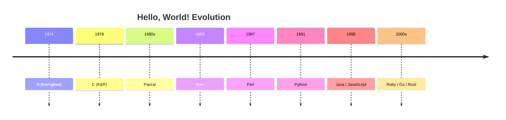

# 🌍 „Hello, World!“ პროგრამის ისტორია და ევოლუცია

„Hello, World!“ არის ყველაზე ცნობილი პირველი პროგრამა, რომელიც თითქმის ყველა პროგრამირების ენაში გამოიყენება როგორც საწყისი მაგალითი. მისი მთავარი იდეა არის კოდის მინიმალური მაგალითით ტექსტის გამოჭრა ეკრანზე.  

ეს ტრადიცია დაიწყო 1970-იან წლებში და დღემდე გრძელდება.

---

## 🟡 1974 – B (Brian Kernighan)

პირველი ცნობადი ვერსია გამოჩნდა ბრაიან კერნიგანის სტატიაში *A Tutorial Introduction to the Language B*.

```b
main( ) {
    extrn a, b, c;
    putchar(a); putchar(b); putchar(c); putchar('!*n');
}
a 'hell';
b 'o, w';
c 'orld';
```

➡️ ბეჭდავდა ტექსტს: **hello, world**

---

## 🔵 1978 – C (Kernighan & Ritchie)

ყველაზე ცნობილი ვერსია, რომელიც გაჩნდა წიგნში *The C Programming Language* (K&R).

```c
#include <stdio.h>

int main(void) {
    printf("hello, world\n");
    return 0;
}
```

---

## 🟠 1980-იანი წლები – Pascal

Pascal-ში მარტივი მაგალითი:

```pascal
program Hello;
begin
  writeln('Hello, World!');
end.
```

---

## 🔵 1983 – C++

Bjarne Stroustrup-ის C++ მაგალითი:

```cpp
#include <iostream>
using namespace std;

int main() {
    cout << "Hello, World!" << endl;
    return 0;
}
```

---

## 🟢 1987 – Perl

Larry Wall-ის Perl-ში:

```perl
print "Hello, world!\n";
```

---

## 🟡 1991 – Python

Guido van Rossum-ის Python-ი გახდა ყველაზე მარტივი და პოპულარული მაგალითი:

```python
print("Hello, World!")
```

---

## 🟣 1995 – Java

```java
class HelloWorld {
    public static void main(String[] args) {
        System.out.println("Hello, World!");
    }
}
```

---

## 🔴 1995 – JavaScript

```javascript
console.log("Hello, World!");
```

---

## ⚪ 2000-იანი წლები – თანამედროვე ენები

**Ruby**  
```ruby
puts "Hello, World!"
```

**Go (2009)**  
```go
package main
import "fmt"

func main() {
    fmt.Println("Hello, World!")
}
```

**Rust (2010)**  
```rust
fn main() {
    println!("Hello, World!");
}
```

---

# 🗂️ ქრონოლოგია (Mermaid Diagram)



---

# 📌 რატომ გახდა ეს ტრადიცია?

- **სიმარტივე** – პროგრამის ყველაზე მარტივი მაგალითია.
- **ტესტირება** – ადვილია შეამოწმო, მუშაობს თუ არა ახალი ენა, კომპილატორი ან გარემო.
- **კულტურული სიმბოლო** – წიგნებიდან და სასწავლო მასალებიდან გავრცელდა მთელ მსოფლიოში.
- **უნივერსალურობა** – თითქმის ყველა ენას აქვს საკუთარი „Hello, World!“ ვერსია.

---

✍️ **ავტორი იდეის**: ბრაიან კერნიგანი (1974, B ენა)  
📘 **გლობალური გავრცელება**: *The C Programming Language* – Brian Kernighan & Dennis Ritchie (1978)
